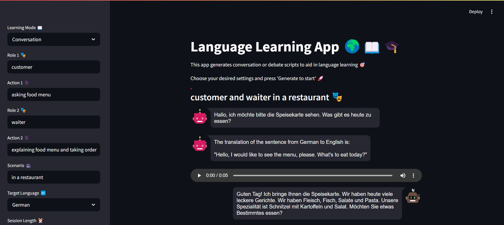
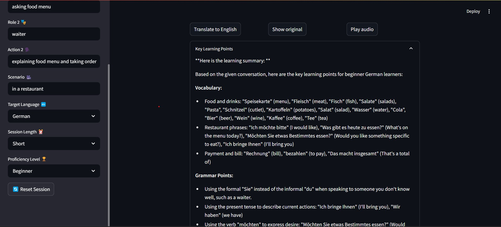

# 🧠🌍 Dual Chatbot Language Learning App

An interactive Streamlit web app that simulates intelligent, real-time conversations between two AI chatbots to help you **practice and learn foreign languages**. You choose the language, roles, context, and proficiency level — the bots do the talking.

---

## 📸 Demo Screenshots

| Conversation Mode | Summary Output |
|-------------------|----------------|
|  |  |

---

## 📚 Table of Contents

- [📚 Features](#-features)
- [🛠 Setup Instructions](#-setup-instructions)
- [🧠 Tech Stack](#-tech-stack)
- [📁 Project Structure](#-project-structure)
- [🙏 Acknowledgements & Inspiration](#-acknowledgements--inspiration)
- [🛡️ License](#️-license)

---

## 📚 Features

- 🤖 **Dual Chatbot Interaction**: Simulates realistic dialogues between AI characters.
- 🌐 **Language Support**: English, German, Spanish, and French.
- 🎭 **Custom Role Scenarios**: Define your own characters, actions, and scene.
- 🧑‍🏫 **Learning Modes**: Choose between role-based conversation or topic-based debate.
- 🧠 **AI-Level Matching**: Customize based on Beginner, Intermediate, or Advanced learners.
- 🔊 **Text-to-Speech**: Listen to bot responses in the target language.
- 🔄 **English Translation**: View original and translated responses.
- 📝 **Smart Summary**: Get a language-learning oriented summary of key grammar, vocabulary, and phrases.

---

## 🛠 Setup Instructions

### 📥 1. Clone the Repository

```bash
git clone https://github.com/nav-neit/DUAL-CHATBOT-LANGUAGE-LEARNING-APP.git
cd dual-chatbot-language-app
```

### 📥 2. Create and Activate a Virtual Environment

```bash
conda create --prefix ./venv python==3.9
conda activate ./venv
```

### 📥 3. Install Dependencies
```bash
pip install -r requirements.txt
```

### 📥 4. Set Up Environment Variables

Create a `.env` file in the root directory and add your Groq API key

```env
GROQ_API_KEY=your-groq-api-key-here
```
You can get a key from https://console.groq.com.


### 📥 5. Run the App
To start the application , run the folllowing command
```bash
streamlit run app.py
```
This will open the app in your default web browser
If not, navigate manually to http://localhost:8501

## 🧠 Tech Stack

| Layer             | Technology                            |
|------------------|----------------------------------------|
| 👨‍💻 Frontend     | [Streamlit](https://streamlit.io)        |
| 🧠 LLM API        | [Groq (LLama3)](https://groq.com)       |
| ⚙️ AI Framework   | [LangChain](https://www.langchain.com) |
| 🗣️ Text-to-Speech | [gTTS](https://pypi.org/project/gTTS/) |
| 💾 Memory Buffer  | `ConversationBufferMemory`             |
| 🔐 Env Handling   | `python-dotenv`                        |

---

## 📁 Project Structure

```plaintext
dual-chatbot-language-app/
├── app.py                 # Main Streamlit app
├── dual_chat_bot.py       # Dual bot orchestration logic
├── single_chat_bot.py     # Abstraction for single chatbot logic
├── .env                   # Environment variables (e.g., GROQ_API_KEY)
├── requirements.txt       # Project dependencies
├── screenshots/           # Optional folder for UI images
└── README.md              # Project documentation
```
---

## 🙏 Acknowledgements & Inspiration

This project was **heavily inspired by** the excellent work of [Dr. Shuai Guo](https://medium.com/@shuaiguo), whose original Medium article and GitHub repository laid the foundation for this idea:

- 📄 **Original Article**: [Building an AI-Powered Language Learning App](https://medium.com/data-science/building-an-ai-powered-language-learning-app-learning-from-two-ai-chatting-6db7f9b0d7cd)
- 💻 **Original Repo**: [ShuaiGuo16/language_learning_app](https://github.com/ShuaiGuo16/language_learning_app)
- 👨‍🎓 [Google Scholar Profile](https://scholar.google.com/citations?user=F8A2PUQAAAAJ&hl=en)

---

## 🔧 Enhancements in This Version

This repository adapts and builds upon the original project with the following updates:

- 🔁 Switched the LLM backend from OpenAI to **LLaMA3 via Groq** (open-source integration)
- 🛠️ Fixed bugs related to session state and variable access
- 🎨 Improved **UI structure** using Streamlit best practices
- 🔄 Added **Reset Session** button and toggle controls
- 🧠 Added refinements to **summary rendering**, message translation, and user experience

Special thanks to Dr. Shuai Guo for the original concept and thoughtful design.

---

## 🛡️ License

This project is licensed under the MIT License. See the [LICENSE](LICENSE.txt) file for details.